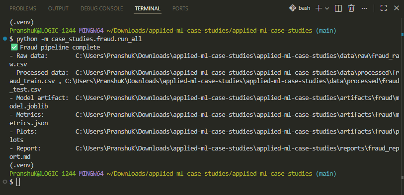
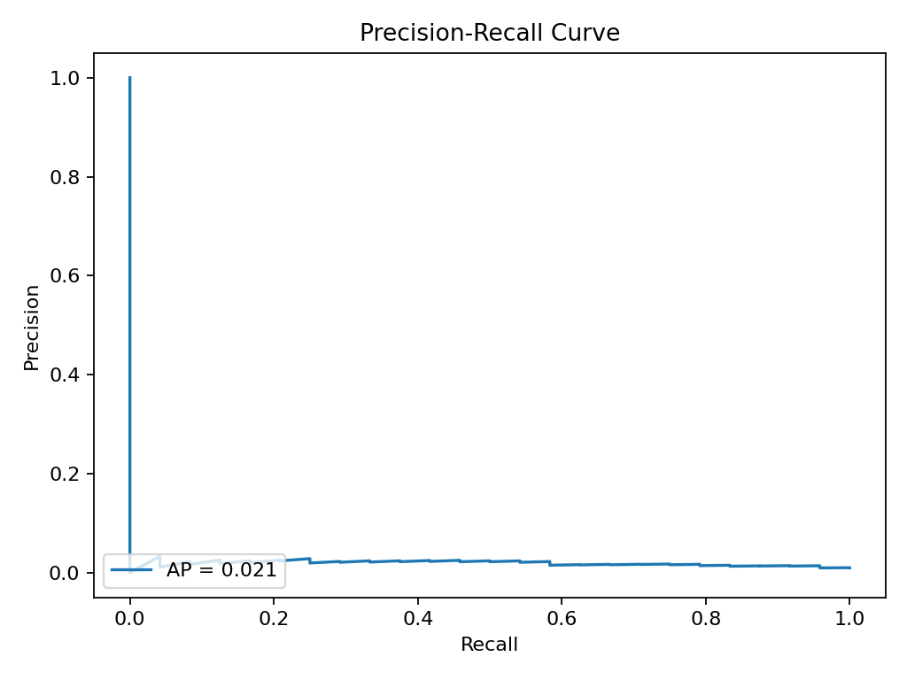
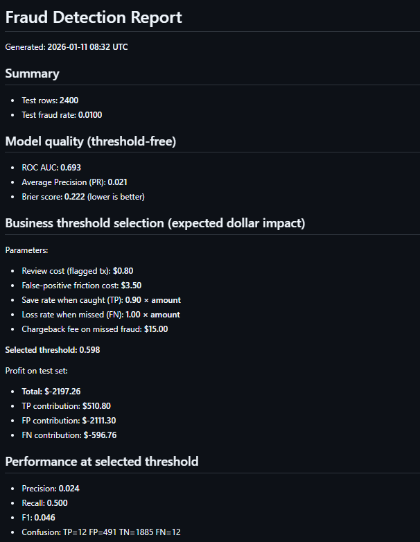
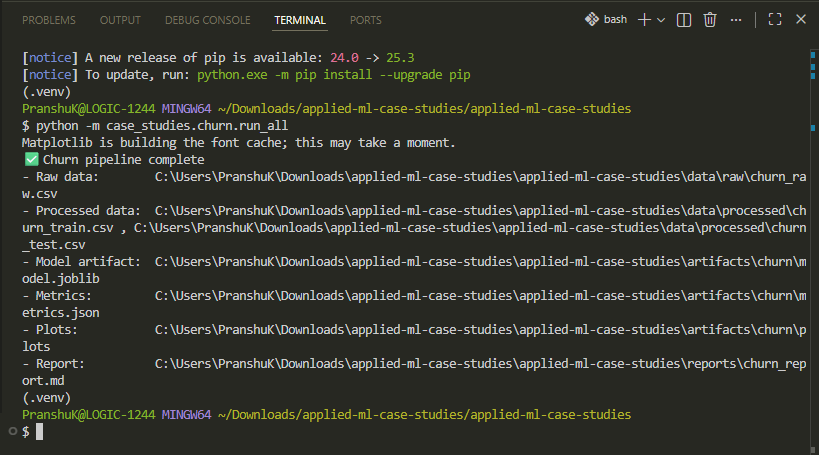
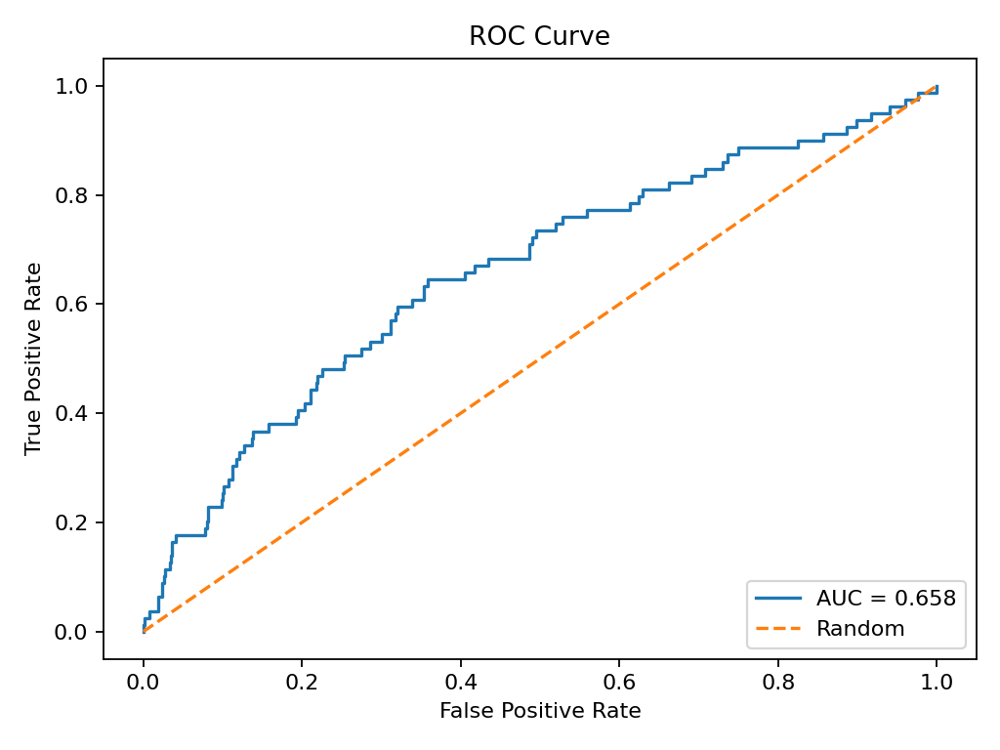
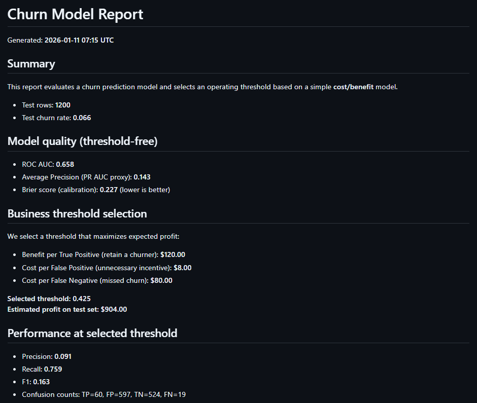

# Applied ML Case Studies (Business-First Portfolio)

A portfolio of **realistic, business-driven machine learning case studies** — built like production work, not toy notebooks.

This repo demonstrates how ML is actually used in companies:

- **Problem framing + KPIs**
- Data + feature engineering
- Modeling and evaluation
- **Decision thresholds + cost/benefit tradeoffs**
- Reproducible runs with generated artifacts (**plots, metrics, reports**)

Unlike typical “model demo” repos, this project shows how predictions become **decisions**.

---

## Featured Case Studies (Ready to Run)

### 1) Customer Churn Prediction (Product / Subscription)

Predict customers likely to churn and recommend an action threshold based on **business cost vs benefit**.

Run:
```bash
python -m case_studies.churn.run_all
# or
make churn
```

Outputs:
- `reports/churn_report.md`
- `artifacts/churn/metrics.json`
- `artifacts/churn/plots/*.png`
- `artifacts/churn/model.joblib`

📁 Location: `case_studies/churn/`

---

### 2) Fraud Detection (Payments / Risk)

Detect fraudulent transactions and select an operating threshold using **expected dollar impact** (review cost vs prevented fraud loss vs false-positive friction).

Why it matters: fraud is highly imbalanced, so this case prioritizes **Precision–Recall** and chooses the operating threshold by **expected dollar impact**, not accuracy.

Run:
```bash
python -m case_studies.fraud.run_all
# or
make fraud
```

Outputs:
- `reports/fraud_report.md`
- `artifacts/fraud/metrics.json`
- `artifacts/fraud/plots/*.png`
- `artifacts/fraud/model.joblib`

📁 Location: `case_studies/fraud/`

---

## Tech Stack

- **Python**: pandas, numpy  
- **Modeling**: scikit-learn  
- **Artifacts**: joblib + JSON  
- **Plots**: matplotlib  
- **Config**: YAML  
- **Quality-of-life**: Makefile + GitHub Actions (CI)

---

## Project Structure

```text
applied-ml-case-studies/
├─ case_studies/
│  ├─ churn/
│  ├─ fraud/
│  └─ _shared/
├─ data/
│  ├─ raw/
│  └─ processed/
├─ artifacts/
│  ├─ churn/
│  └─ fraud/
├─ reports/
├─ requirements.txt
├─ Makefile
└─ .github/workflows/ci.yml
```

---

## Quickstart

```bash
git clone https://github.com/pranshu1921/applied-ml-case-studies.git
cd applied-ml-case-studies

python -m venv .venv
# mac/linux
source .venv/bin/activate
# windows powershell
# .\.venv\Scripts\Activate.ps1

pip install -U pip
pip install -r requirements.txt
```

Run either case study:

```bash
make churn
make fraud
```

---

## Generated Artifacts (Examples)

These images are produced by running the pipelines locally.

### Fraud Detection

**Pipeline execution**


**Precision–Recall curve (key metric for imbalanced fraud)**


**Generated report**


### Churn Prediction

**Pipeline execution**


**ROC curve**


**Generated report**


---

## Notes on Realism

This project uses **synthetic-but-realistic datasets** so anyone can run the pipelines without external downloads or licensing issues.  
The emphasis is on **workflow correctness and business reasoning**, not Kaggle-style leaderboard tuning.

---

## Author

**Pranshu Kumar Premi**  
LinkedIn: https://www.linkedin.com/in/pranshu-kumar  
Email: pranshukumarpremi@gmail.com
