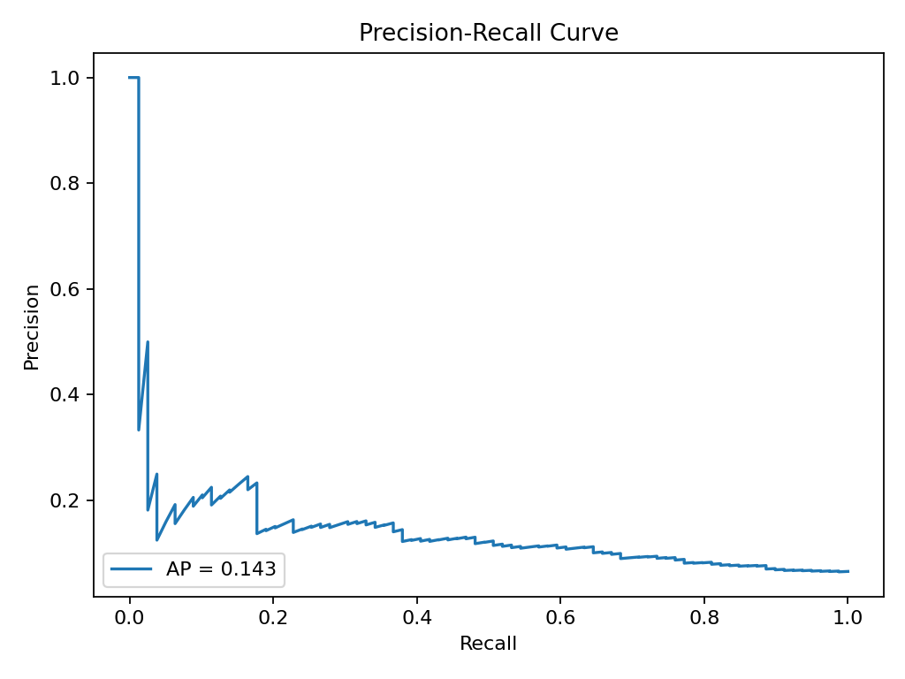

# Applied ML Case Studies (Business-First Portfolio)

A recruiter-friendly portfolio of **realistic, business-driven machine learning case studies** — built like production work, not toy notebooks.

This repo demonstrates how ML is actually used in companies:

- **Problem framing + KPIs**
- Data + feature engineering
- Modeling and evaluation
- **Decision thresholds + cost/benefit tradeoffs**
- Reproducible runs with generated artifacts (**plots, metrics, reports**)

Unlike typical “model demo” repos, this project shows how predictions become **decisions**.

---

## Featured Case Study (Ready to Run)

### 1) Customer Churn Prediction (Product / Subscription)

Predict customers likely to churn and recommend an action threshold based on **business cost vs benefit**.

**One command produces everything:**
- A trained model artifact
- `metrics.json` with model + business metrics
- ROC / PR / calibration plots
- A Markdown report you can screenshot and share

📁 Location: `case_studies/churn/`

---

## Tech Stack

- **Python**: pandas, numpy  
- **Modeling**: scikit-learn (logistic regression baseline)  
- **Artifacts**: joblib model serialization + JSON metrics  
- **Plots**: matplotlib  
- **Config**: YAML  
- **Quality-of-life**: Makefile + GitHub Actions (CI)

---

## Project Structure

```text
applied-ml-case-studies/
├─ case_studies/
│  ├─ churn/
│  │  ├─ run_all.py              # end-to-end: dataset → preprocess → train → eval → report
│  │  ├─ config.yaml             # feature + model + business settings
│  │  ├─ README.md               # case-specific explanation
│  │  └─ src/
│  │     ├─ make_dataset.py      # generates realistic synthetic data (no external download)
│  │     ├─ preprocess.py        # cleaning, splitting, leakage-safe transforms
│  │     ├─ train.py             # model training + saving artifact
│  │     ├─ evaluate.py          # metrics + plots + threshold selection
│  │     └─ report.py            # builds a markdown report
│  └─ _shared/
│     ├─ io.py                   # paths + file helpers
│     ├─ metrics.py              # evaluation utilities
│     └─ plotting.py             # plotting helpers
├─ data/
│  ├─ raw/
│  └─ processed/
├─ artifacts/
│  └─ churn/
│     └─ plots/
├─ reports/
├─ requirements.txt
├─ Makefile
└─ .github/workflows/ci.yml
```

---

## Quickstart

### 1) Setup
Prereqs: **Python 3.10+**, Git

```bash
git clone https://github.com/pranshu1921/applied-ml-case-studies.git
cd applied-ml-case-studies

python -m venv .venv
# mac/linux
source .venv/bin/activate
# windows powershell
# .\.venv\Scripts\Activate.ps1

pip install -U pip
pip install -r requirements.txt
```

### 2) Run end-to-end pipeline
```bash
python -m case_studies.churn.run_all
# or
make churn
```

### 3) View outputs
- Report: `reports/churn_report.md`
- Plots: `artifacts/churn/plots/`
- Metrics: `artifacts/churn/metrics.json`
- Model: `artifacts/churn/model.joblib`

---

## Generated Artifacts (From a Real Run)

Below are examples produced by running:

```bash
python -m case_studies.churn.run_all
```

### Pipeline Execution


### Model Evaluation

**ROC Curve**  


**Precision–Recall Curve**  


### Generated Business Report


These files are generated on every run:

- `artifacts/churn/model.joblib`
- `artifacts/churn/metrics.json`
- `artifacts/churn/plots/*.png`
- `reports/churn_report.md`

They mirror how production ML systems create reviewable outputs for debugging, validation, and decision-making.

---

## Notes on Realism

This project intentionally uses **synthetic-but-realistic datasets** to:
- avoid licensing issues  
- ensure reproducible runs for anyone cloning the repo  
- simulate real product data patterns (tenure, usage, pricing, support, payments)

The emphasis is on **workflow correctness and business reasoning**, not Kaggle leaderboard tricks.

---

## Author

**Pranshu Kumar Premi**  
LinkedIn: https://www.linkedin.com/in/pranshu-kumar  
Email: pranshukumarpremi@gmail.com

If you’re building ML/AI products or data-intensive systems, I’d love to connect.
