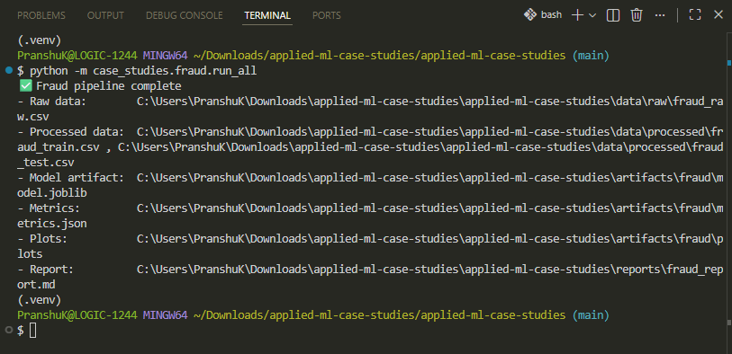
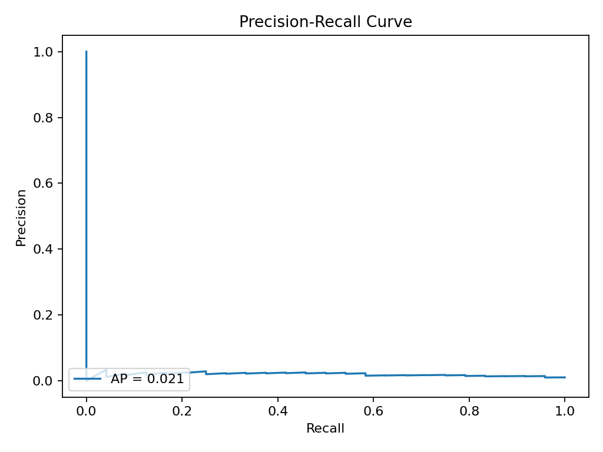
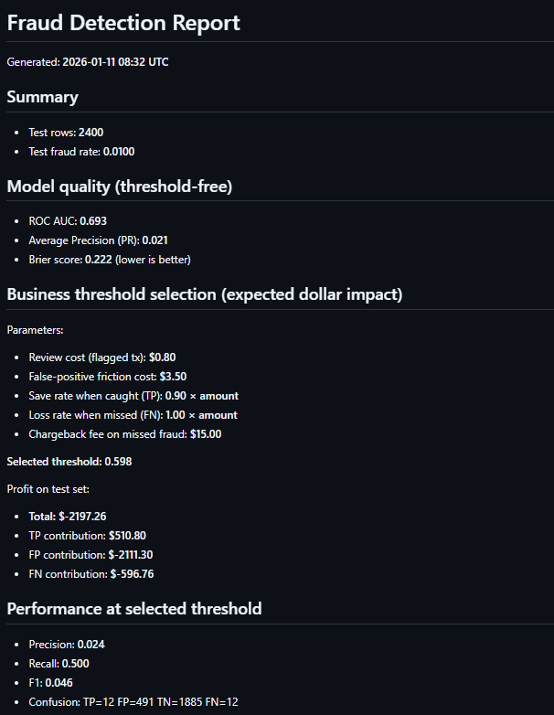
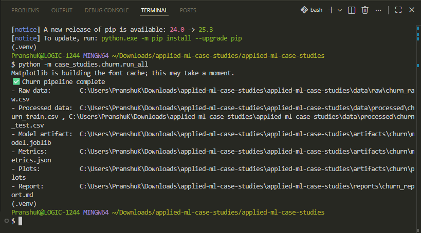
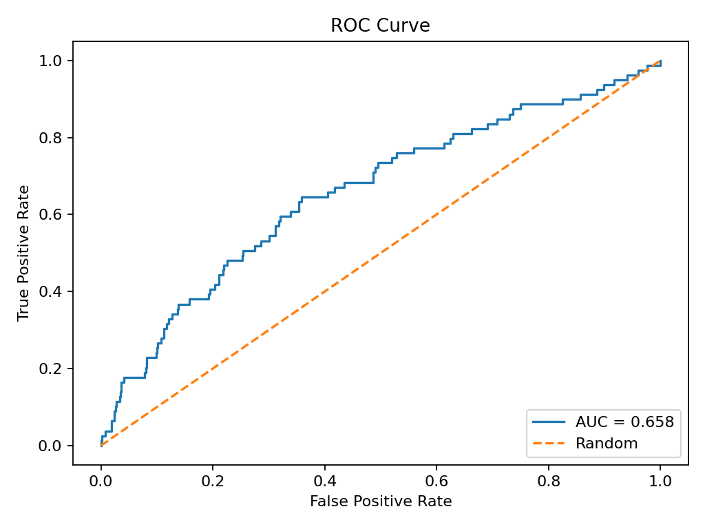
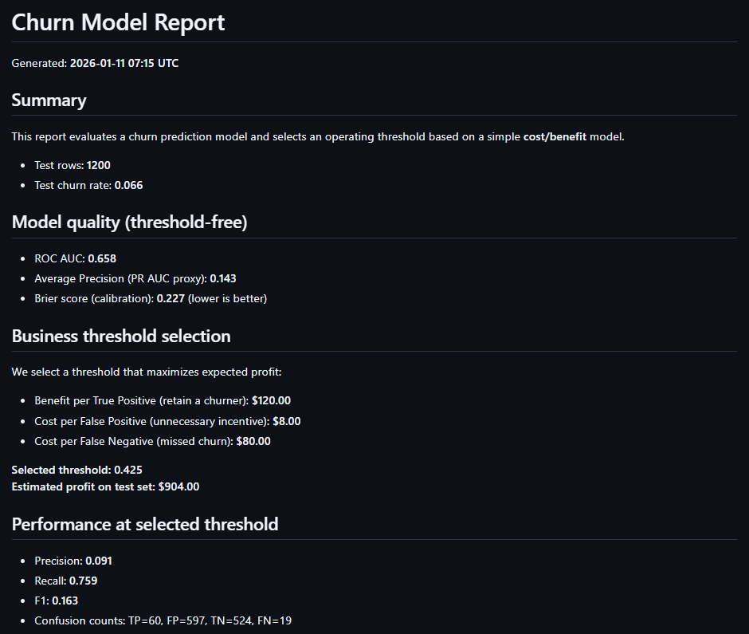

# Applied ML Case Studies: Business-Driven Machine Learning

Production-oriented ML case studies that show how predictions become decisions.

Each case study covers the full workflow: problem framing, feature engineering, modeling, evaluation, and threshold selection based on business cost and benefit. The emphasis is on workflow correctness and business reasoning rather than leaderboard optimization.

---

## Case Studies

### Customer Churn Prediction

Predict customers likely to churn and recommend an operating threshold based on business cost versus benefit tradeoffs.

The model is evaluated not just on AUC but on the cost of false negatives (lost customers) versus the cost of false positives (unnecessary retention spend). The selected threshold reflects that business logic, not just statistical performance.

Run:
```bash
make churn
```

Outputs:
- `reports/churn_report.md`
- `artifacts/churn/metrics.json`
- `artifacts/churn/plots/*.png`
- `artifacts/churn/model.joblib`

Location: `case_studies/churn/`

---

### Fraud Detection

Detect fraudulent transactions and select an operating threshold using expected dollar impact — review cost versus prevented fraud loss versus false-positive friction.

Fraud is highly imbalanced, so this case prioritizes Precision-Recall over accuracy and selects the threshold by expected dollar impact per 10,000 transactions rather than by a statistical metric alone.

Run:
```bash
make fraud
```

Outputs:
- `reports/fraud_report.md`
- `artifacts/fraud/metrics.json`
- `artifacts/fraud/plots/*.png`
- `artifacts/fraud/model.joblib`

Location: `case_studies/fraud/`

---

## Performance Results

Run both pipelines locally to generate actual metrics. Results are saved automatically to `artifacts/*/metrics.json` and summarized in `reports/`.

### Churn Model

| Metric | Value |
|--------|-------|
| AUC-ROC | run `make churn` to generate |
| Precision at selected threshold | run `make churn` to generate |
| Recall at selected threshold | run `make churn` to generate |

### Fraud Model

| Metric | Value |
|--------|-------|
| AUC-PR | run `make fraud` to generate |
| Precision at operating threshold | run `make fraud` to generate |
| Expected dollar impact per 10K transactions | run `make fraud` to generate |

---

## Tech Stack

- **Python**: pandas, numpy
- **Modeling**: scikit-learn
- **Artifacts**: joblib and JSON
- **Plots**: matplotlib
- **Config**: YAML
- **Automation**: Makefile and GitHub Actions CI

---

## Project Structure

```
applied-ml-case-studies/
├── case_studies/
│   ├── churn/
│   ├── fraud/
│   └── _shared/
├── data/
│   ├── raw/
│   └── processed/
├── artifacts/
│   ├── churn/
│   └── fraud/
├── reports/
├── requirements.txt
├── Makefile
└── .github/workflows/ci.yml
```

---

## Quickstart

```bash
git clone https://github.com/pranshu1921/applied-ml-case-studies.git
cd applied-ml-case-studies

python -m venv .venv
source .venv/bin/activate        # Mac/Linux
# .\.venv\Scripts\Activate.ps1  # Windows PowerShell

pip install -U pip
pip install -r requirements.txt
```

Run either case study:

```bash
make churn
make fraud
```

---

## Generated Artifacts

These images are produced by running the pipelines locally.

### Fraud Detection

**Pipeline execution**


**Precision-Recall curve**


**Generated report**


### Churn Prediction

**Pipeline execution**


**ROC curve**


**Generated report**


---

## A Note on the Datasets

Both case studies use synthetic but realistic datasets so anyone can run the pipelines without external downloads or licensing requirements. The data distributions and class imbalances are designed to reflect real-world characteristics of churn and fraud problems.

---

## License

MIT

---

## Contact

**Pranshu Kumar**
- GitHub: [github.com/pranshu1921](https://github.com/pranshu1921)
- LinkedIn: [linkedin.com/in/pranshu-kumar](https://www.linkedin.com/in/pranshu-kumar)
- Email: pranshukumarpremi@gmail.com
